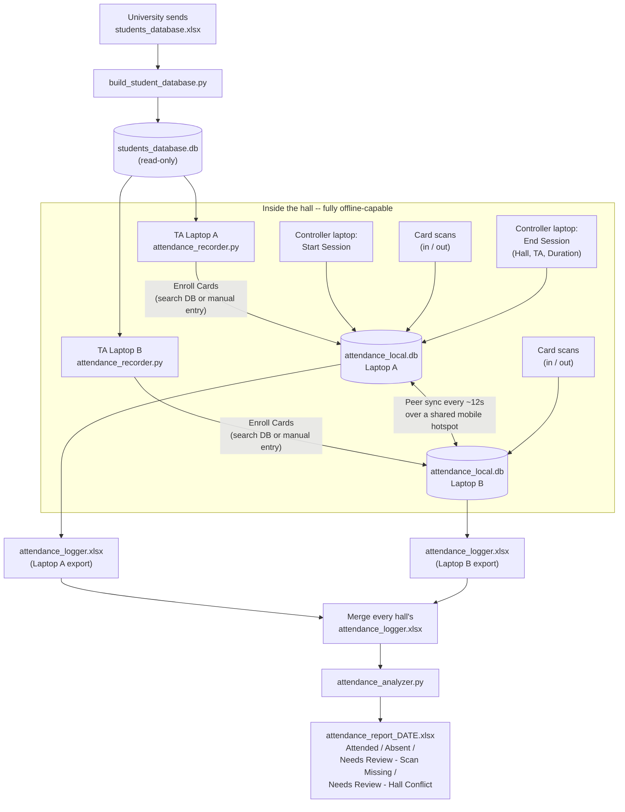

# Automated Attendance Recording

Card-based attendance tracking for university lecture halls, built to replace
manual sign-in sheets with contactless card scans -- while working fully
offline, syncing two TA laptops live over a shared mobile hotspot, and
producing a per-session attendance report automatically.

---

## Table of contents

- [Purpose](#purpose)
- [How it works, end to end](#how-it-works-end-to-end)
- [How to use this repo](#how-to-use-this-repo)
- [Building a standalone desktop app (.exe)](#building-a-standalone-desktop-app-exe)
- [Technical details](#technical-details)
- [Testing](#testing)
- [Known limitations / roadmap](#known-limitations--roadmap)
- [Privacy & data handling](#privacy--data-handling)
- [License](#license)

---

## Purpose

A university course needs to record attendance for ~100+ students per hall,
across multiple sessions a day, with a firm rule: a student must be present
for at least a set fraction (default 75%) of a session's actual duration to
count as attended. Doing this by hand -- a TA manually logging names on
paper -- doesn't scale and is error-prone.

This project automates it with an RFID/NFC card reader (OMNIKEY 5427 G2, in
keyboard-emulation mode) and a lightweight desktop app, with three
constraints that shaped every design decision:

- **The building's internet is unreliable.** Nothing during class can
  depend on it.
- **Two TAs, two scanners, one hall.** Both need to record scans in
  parallel and end up with one consistent, merged picture of who's in/out.
- **Most TAs are not programmers.** The distributed artifact has to be a
  double-click desktop app, not a script.

## How it works, end to end



Each laptop keeps its own local SQLite database and stays fully functional
with zero internet. The two laptops in the same hall sync directly with
each other over a private local network (a phone's mobile hotspot works
well) -- not the venue's WiFi -- so a student tapping in on one scanner and
out on the other is still recognized as one continuous visit. Getting each
hall's data to the person generating the final report is a separate,
lower-urgency step that can tolerate a real internet connection being
available only intermittently.

## How to use this repo

Follow these in order:

### 1. Get the student roster as an Excel file

You need `students_database.xlsx` with (at minimum) these three columns,
in this order:

| ID | Student Name | Faculty |
|----|---------------|---------|
| 40-1234 | Alice Example | Engineering |

Extra columns are fine -- they're ignored. Place this file in the project
folder. **This file is not, and should not be, committed to the repo** (see
[Privacy & data handling](#privacy--data-handling)).

### 2. Build the read-only student database

```bash
pip install openpyxl
python build_student_database.py
```

This converts `students_database.xlsx` into `students_database.db`
(SQLite) and marks it **read-only on disk**. The recorder app also opens it
in SQLite's read-only mode. Together, these prevent a non-technical TA from
accidentally corrupting or editing ~400 students' data through Excel or
otherwise. Re-run this script (it safely rebuilds from scratch) whenever
the university sends an updated roster.

### 3. Run the recorder on each TA's laptop

```bash
pip install openpyxl
python attendance_recorder.py
```

(Or the packaged `.exe` -- see the next section.) On first launch, you'll
be asked for the TA's name and whether this laptop **controls sessions**
(only one of the two laptops per hall should have this checked -- see
[Technical details](#technical-details)).

Then, per class:

1. **Enroll Cards** -- scan a card, search its Student ID against the
   database (auto-fills Name/Faculty), or enter details manually if it's
   not found.
2. **Setup & Sync** -- both laptops on the same mobile hotspot, type in
   the partner's address, click **Connect & Start Syncing**.
3. **Attendance** -- Controller laptop clicks **Start Session**; both
   laptops scan cards as students enter/exit; Controller clicks
   **End Session** and enters Hall / TA name / actual duration.

This produces `attendance_logger.xlsx` on each laptop, auto-refreshed after
every sync and every End Session.

### 4. Merge every hall's log

At day's end, gather every hall's `attendance_logger.xlsx` into one file
(e.g. via a shared Drive folder or Sheet) -- this step tolerates a slow or
delayed internet connection, unlike the in-hall sync in step 3.

### 5. Generate the attendance report

Run once, by the lecturer or a senior TA, on the merged file:

```bash
python attendance_analyzer.py --input attendance_logger.xlsx --date 2026-08-19
```

Produces `attendance_report_<date>.xlsx`: `Card UID | Student ID | Name |
<session columns>`, with each student marked `Attended`, `Absent`,
`Needs Review - Scan Missing`, or `Needs Review - Hall Conflict` per
session.

## Building a standalone desktop app (.exe)

TAs shouldn't need Python installed. Build a single-file Windows
executable with [PyInstaller](https://pyinstaller.org/):

```powershell
pip install pyinstaller openpyxl
python -m PyInstaller --onefile --windowed attendance_recorder.py
```

> **Use `python -m PyInstaller`, not the bare `pyinstaller` command.** `pip`
> installs the `pyinstaller` console script into a `Scripts` folder that
> often isn't on Windows' `PATH`, which produces a
> `'pyinstaller' is not recognized...` error even though the package is
> correctly installed. Running it as a module sidesteps that entirely.

Run this from the folder containing `attendance_recorder.py`,
`attendance_db.py`, and `sync_service.py` together (PyInstaller needs to
see all three).

After building, your distributable folder is just:

```
dist/
├── attendance_recorder.exe
└── students_database.db      <-- copy this in manually; do NOT try to bundle it into the exe
```

`students_database.db` is deliberately **not** embedded in the executable
-- the app reads it from disk at runtime by filename, and PyInstaller's
`--onefile` bundling would put it somewhere the app can't reach. Keeping it
as a sibling file also means updating the roster is just replacing that one
file, no rebuild required.

`device_config.json`, `attendance_local.db`, and `attendance_logger.xlsx`
are **not** shipped -- each laptop generates its own on first run, anchored
to the `.exe`'s own folder regardless of how it's launched.

PyInstaller only builds for the OS it runs on -- build on a Windows machine
to get a `.exe`. If you're on a very new Python version and the build
fails partway through, that's usually PyInstaller lagging a brand-new
Python release; falling back to Python 3.11/3.12 for the build step
resolves it.

## Technical details

### Project layout

| File | Role |
|---|---|
| `build_student_database.py` | One-time/refresh tool: `students_database.xlsx` &rarr; read-only `students_database.db` |
| `attendance_db.py` | SQLite storage layer (roster, sessions, scans) -- every function opens its own short-lived connection (WAL mode + busy-timeout), safe across threads |
| `sync_service.py` | Peer-to-peer HTTP sync between the two TA laptops (`/ping`, `/sync`), plus local-IP discovery |
| `attendance_recorder.py` | The GUI each TA runs: Attendance, Enroll Cards, Setup & Sync tabs |
| `attendance_analyzer.py` | Run once on the merged log to produce the day's report |
| `test_sync.py` | Automated tests for the sync layer (outage, restart, duplicate-merge safety) |
| `SYNC_TEST_PLAN.md` | Manual system test plan for real-hardware scenarios |

### Data model

Each laptop's `attendance_local.db`:

- **`roster`** -- `uid, student_id, name, faculty, updated_at` (upsert,
  last-write-wins)
- **`sessions`** -- `session_id, hall, ta_name, duration_minutes,
  started_at, closed_at, updated_at` (open session = `duration_minutes IS
  NULL`)
- **`scans`** -- `id, uid, student_id, name, faculty, session_id, source,
  ts` (insert-only, immutable, deduplicated by `id`)

Exported `attendance_logger.xlsx`: one sheet per date, columns `Time | UID
| Student ID | Name | Faculty | Session ID | Hall Number | TA Name |
Duration (min)`.

### Sync architecture

- Each laptop runs a small built-in HTTP server (Python's standard library
  only, no extra dependency) on port `8765`.
- `POST /sync`: the caller sends its full local dataset, the peer merges it
  in and replies with its own -- one round trip fully merges both sides.
  Scans are deduplicated by ID (safe to re-sync endlessly); roster/session
  rows use last-write-wins by `updated_at`.
- Full-table exchange every round (not incremental) -- deliberately simple
  given the data volumes involved (a few hundred students, a few thousand
  scans a term), which avoids an entire class of cursor-tracking bugs.
- One laptop is the **Controller** (generates Session IDs, starts/ends
  sessions); the other is the **Helper** (follows along via sync). Either
  laptop can flip a checkbox to become Controller -- e.g. if the original
  Controller's laptop fails mid-class.

### Attendance evaluation rules

Per student, per session, after all halls are merged:

1. Scans tagged with **more than one Hall Number** for the same session
   &rarr; `Needs Review - Hall Conflict`
2. Otherwise, an **odd** number of scans &rarr; `Needs Review - Scan
   Missing`
3. Otherwise, scans are paired as (in, out), (in, out)... and summed:
   `Attended` if total minutes &ge; `session duration x 0.75`
   (`ATTENDANCE_RATIO` in `attendance_analyzer.py`), else `Absent`

### Requirements

- Python 3.10+ (openpyxl and PyInstaller both support this comfortably;
  very new Python versions may lag PyInstaller support)
- `pip install openpyxl` (runtime)
- `pip install pyinstaller` (build-time only)

## Testing

- `python test_sync.py` -- automated suite covering bidirectional sync,
  duplicate-safety, partner-unreachable handling, recovery after an
  outage, and restart-mid-session safety.
- `SYNC_TEST_PLAN.md` -- manual test plan for scenarios that need real
  hardware: killing WiFi mid-session, closing a laptop's lid, restarting
  the app mid-sync, both laptops accidentally set as Controller, and a
  full offline dry run.

## Known limitations / roadmap

- `HALL_LIST` and `FACULTY_LIST` in `attendance_recorder.py` are
  placeholders -- edit them to match the real hall/faculty lists.
- One Controller per hall at a time; failover is a manual checkbox, not
  automatic.
- Cross-hall merging (step 4 above) is currently manual (e.g. a shared
  Drive folder/Sheet); could be automated further if useful.
- Packaging must be done on Windows to produce a Windows `.exe`
  (PyInstaller doesn't cross-compile).

## Privacy & data handling

This repository intentionally contains **no student data and no
university-proprietary information**. `students_database.xlsx`,
`students_database.db`, `attendance_local.db`, `attendance_logger.xlsx`,
`attendance_report_*.xlsx`, and `device_config.json` are all
generated/provided locally and should never be committed. A `.gitignore`
covering these is included in this repo -- double-check it's in place
before your first commit with real data anywhere near the working folder.

## License

This project is licensed under the **MIT License** -- see `LICENSE`.

MIT is a reasonable, low-friction choice here: it's short, permissive, and
imposes essentially no restrictions on how a university (or anyone else)
adopts, modifies, or redistributes the code, which fits a small internal
academic tool well. A couple of things worth being aware of, in case they
change your mind:

- **MIT grants no explicit patent license** (Apache-2.0 does). Almost
  certainly irrelevant for a tool like this, but Apache-2.0 is worth a look
  if that ever matters to you.
- **MIT doesn't require derivative works to stay open-source.** If you'd
  want to guarantee that anyone who builds on this must also share their
  changes, a copyleft license like GPL-3.0 (or AGPL-3.0, which also covers
  network use) would enforce that -- MIT deliberately does not.

One clarification, since your note about student data privacy came right
alongside the license question: **the license governs code reuse rights,
not data handling** -- it has no bearing on student privacy. That's
already correctly handled by keeping data files out of the repo entirely
(see above), independent of whatever license you pick. Given that, I'd
keep MIT unless you specifically want the copyleft guarantee.