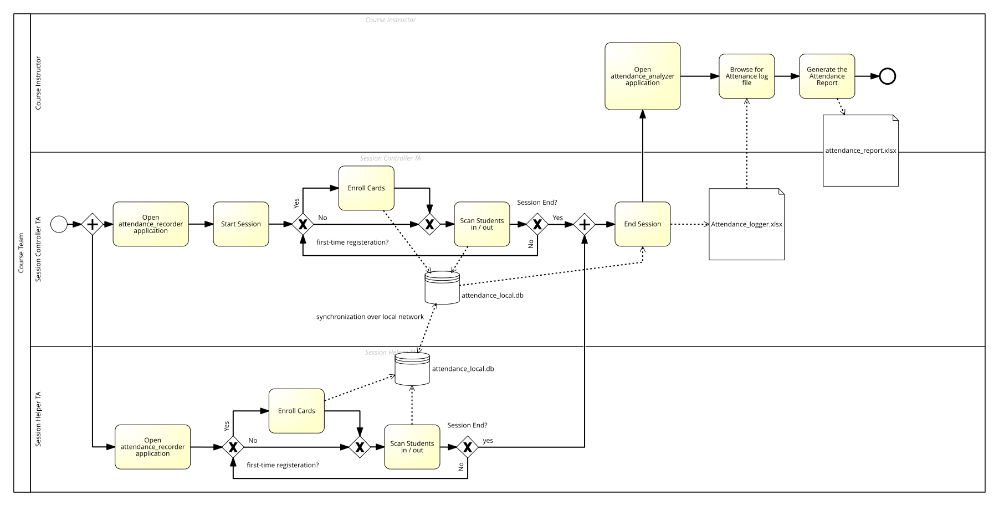

# Automated Attendance Recording

Card-based attendance tracking for university lecture halls -- built to
replace manual sign-in sheets with contactless card scans, work fully
offline, sync two TAs' laptops live over a shared mobile hotspot, and
produce a per-session attendance report automatically.

📄 **For architecture, data model, sync protocol internals, build
instructions, testing, and known limitations, see
[Documentation.md](docs/Documentation.md).** This README covers what the
project does and how to use it.

## Table of contents

- [Purpose](#purpose)
- [Features](#features)
- [How it works, end to end](#how-it-works-end-to-end)
- [Quick start](#quick-start)
- [Repository structure](#repository-structure)
- [Privacy & data handling](#privacy--data-handling)
- [License](#license)

## Purpose

A university course needs to record attendance for 100+ students per hall,
across multiple sessions a day, with a rule: a student must be present for
at least a set fraction (default 75%) of a session's *actual* duration to
count as attended. Doing this by hand doesn't scale and is error-prone --
this project automates it with an RFID/NFC card reader and a pair of
desktop apps, built around three constraints:

- **The building's internet is unreliable** -- nothing during class can
  depend on it.
- **Two TAs, two scanners, one hall** -- both record in parallel and need
  to end up with one consistent, merged picture of who's in/out.
- **Most TAs aren't programmers** -- the distributed artifact is a
  double-click desktop app, not a script.

## Features

- **Offline-first recording.** Each TA's laptop keeps its own local
  database and works with zero internet; the two laptops in a hall sync
  directly with each other over a mobile hotspot, not the venue's WiFi.
- **Two scanners, one merged picture.** A student tapping in on one TA's
  scanner and out on the other's is still recognized as one continuous
  visit, live during class.
- **Student lookup, not re-typing.** Enrolling a card searches the
  university's roster by Student ID and auto-fills name/faculty; the
  roster file itself is opened read-only so it can't be accidentally
  edited.
- **Per-hall-aware evaluation.** The same session number can legitimately
  run a different actual length in different halls -- each student is
  judged against the duration recorded for the hall *they* were in.
- **Clear manual-review flags**, not silent guesses: a missing tap, a
  card scanned in two halls for the same session, or a session whose
  duration was never recorded are each flagged distinctly rather than
  folded into a generic "Absent."
- **Multi-day, chronological reporting** with actual time-spent-in-hall
  per student per session, not just a status label.
- **Two simple desktop apps, no command line required for daily use** --
  one for recording (each TA), one for generating the report (the
  lecturer or a senior TA).

## How it works, end to end



*(Modeled in [SAP Signavio](https://www.signavio.com/) using standard BPMN
notation. The editable source is at
[docs/images/process-flow.bpmn](docs/images/process-flow.bpmn) -- reopen it
in Signavio, Camunda Modeler, or any other BPMN tool to modify it. A more
detailed, implementation-level diagram of the same process lives in
[Documentation.md](docs/Documentation.md#data-flow-diagram).)*

Each laptop keeps its own local database and stays fully functional with
zero internet. The two laptops in the same hall sync directly with each
other over a private local network -- not the venue's WiFi -- so a
student tapping in on one scanner and out on the other is still one
continuous visit. Getting each hall's data to whoever generates the final
report is a separate, lower-urgency step that can tolerate the internet
being available only intermittently.

## Quick start

1. **Get the roster.** `students_database.xlsx` with columns `ID |
   Student Name | Faculty` (extra columns ignored).
2. **Build the read-only student database:**
   ```bash
   pip install openpyxl
   python build_student_database.py
   ```
3. **Run the recorder on each TA's laptop** (or the packaged `.exe`):
   ```bash
   python attendance_recorder.py
   ```
   First launch asks for the TA's name and whether this laptop
   **controls sessions** (only one of the two per hall). Then, per class:
   Enroll Cards &rarr; connect the two laptops on Setup & Sync &rarr;
   Controller starts the session &rarr; scan cards &rarr; Controller ends
   the session (Hall / TA / actual duration).
4. **Merge every hall's `attendance_logger.xlsx`** into one file (e.g. a
   shared Drive folder/Sheet) once the halls are done for the day.
5. **Generate the report** with the desktop app:
   ```bash
   python attendance_analyzer_gui.py
   ```
   Browse to the merged file, pick which date(s) to include (all are
   selected by default), click Generate. Or use the command line:
   `python attendance_analyzer.py --input attendance_logger.xlsx`.

For building the standalone `.exe` versions of both apps, see
[Documentation.md](docs/Documentation.md#building-a-standalone-desktop-app-exe).

## Repository structure

| File | What it's for |
|---|---|
| `build_student_database.py` | Converts the university roster into a read-only database |
| `attendance_recorder.py` | Desktop app each TA runs during class |
| `attendance_analyzer.py` | Report-generation logic, also usable from the command line |
| `attendance_analyzer_gui.py` | Desktop app for generating the report |
| `attendance_db.py`, `sync_service.py` | Internal modules used by the recorder (storage, sync) |
| `test_sync.py` | Automated tests for the sync layer |

Full details on each of these are in [Documentation.md](docs/Documentation.md).

## Privacy & data handling

This repository intentionally contains **no student data and no
university-proprietary information**. `students_database.xlsx`,
`students_database.db`, `attendance_local.db`, `attendance_logger.xlsx`,
`attendance_report_*.xlsx`, and `device_config.json` are all
generated/provided locally and are excluded via `.gitignore` -- double
check it's in place before committing anywhere near real data.

## License

This project is licensed under the **MIT License** -- see `LICENSE`. MIT
is a low-friction choice for a small internal academic tool: short,
permissive, and imposing essentially no restrictions on how a university
adopts, modifies, or redistributes the code. Two things it deliberately
doesn't do, worth knowing about: it grants no explicit patent license
(Apache-2.0 does), and it doesn't require derivative works to stay
open-source (GPL-3.0 would, if that guarantee ever matters). Note that the
license governs code reuse rights only -- it has no bearing on student
data privacy, which is handled entirely by keeping data files out of the
repo (see above).
