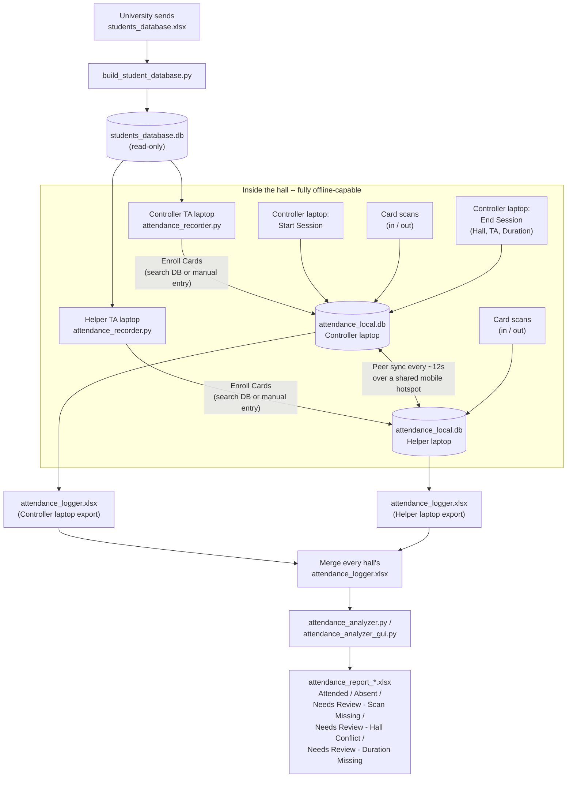

# Technical Documentation

Full technical reference for the Automated Attendance Recording project. See [README.md](../README.md) for a functionality/features overview and the end-to-end process diagram.

## Table of contents

- [Architecture](#architecture)
- [Data flow diagram](#data-flow-diagram)
- [Data model](#data-model)
- [Sync protocol](#sync-protocol)
- [Attendance evaluation rules](#attendance-evaluation-rules)
- [Building a standalone desktop app (.exe)](#building-a-standalone-desktop-app-exe)
- [Testing](#testing)
- [Known limitations / roadmap](#known-limitations--roadmap)

## Architecture

| File | Role |
|---|---|
| `build_student_database.py` | One-time/refresh tool: converts the university's `students_database.xlsx` into a read-only `students_database.db` |
| `attendance_db.py` | SQLite storage layer (roster, sessions, scans). Every function opens its own short-lived connection (WAL mode + busy-timeout) rather than holding one open across threads -- safe for the GUI thread and the background sync thread to call concurrently |
| `sync_service.py` | Peer-to-peer HTTP sync between the two TA laptops (`GET /ping`, `POST /sync`), local-IP discovery, and a thread-safe `SyncStatus` object shared between the outbound sync loop and the inbound HTTP handler |
| `attendance_recorder.py` | GUI each TA runs during class: Attendance (Start/End Session, scanning), Enroll Cards, Setup & Sync |
| `attendance_analyzer.py` | Logic + CLI for Phase II: reads the merged `attendance_logger.xlsx` and produces the attendance report |
| `attendance_analyzer_gui.py` | Desktop GUI wrapper around `attendance_analyzer.py`, for the lecturer/senior TA who generates the report |
| `test_sync.py` | Automated tests for the sync layer (bidirectional merge, duplicate-safety, outage/recovery, restart-mid-session) |

`attendance_analyzer_gui.py` and `attendance_recorder.py` both anchor every file they read/write (config, local database, exports) to their **own `.exe`'s folder** (via `sys.frozen` / `sys.executable` when packaged, `__file__` otherwise) rather than the current working directory -- this matters because double-clicking vs. a shortcut with a different "Start in"
path can otherwise silently put generated files somewhere unexpected.

## Data flow diagram

This is the detailed, implementation-level version of the process. See [README.md](../README.md#how-it-works-end-to-end) for the higher-level BPMN process view.



## Data model

Each laptop's `attendance_local.db`:

- **`roster`** -- `uid, student_id, name, faculty, updated_at` (upsert,
  last-write-wins by `updated_at`)
- **`sessions`** -- `session_id, hall, ta_name, duration_minutes,
  started_at, closed_at, updated_at` (a session is "open" when
  `duration_minutes IS NULL`; End Session fills it in)
- **`scans`** -- `id, uid, student_id, name, faculty, session_id, source,
  ts` (insert-only, immutable, deduplicated by `id` -- safe to re-sync any
  number of times without creating duplicates)

Exported `attendance_logger.xlsx` (written by `attendance_db.export_to_xlsx()`,
auto-refreshed after every sync and every End Session):

- One sheet per date (named `YYYY-MM-DD`), columns:
  `Time | UID | Student ID | Name | Faculty | Session ID | Hall Number | TA Name | Duration (min)`
- One `Roster` sheet: `Card UID | Student ID | Name | Faculty` -- every enrolled student, including ones who never scanned at all. This is how the analyzer catches a fully-absent student instead of them silently not appearing in the report.

> `attendance_analyzer.py` does not actually require the "one sheet per
> date" layout -- it derives each scan's date from its own `Session ID`
> (`YYYYMMDD_N`), not from the sheet it's sitting on. A single flattened
> sheet containing every day's rows works identically. This matters in
> practice: a cross-hall merge (copy/paste into a shared Google Sheet, a
> manual export) can lose the "one tab per date" structure without losing
> any data, and the analyzer tolerates that.

## Sync protocol

- Each laptop runs a small built-in HTTP server (Python's standard library
  only, no extra dependency) on port `8765`.
- `POST /sync`: the caller sends its full local dataset (roster + sessions
  + scans), the peer merges it in and replies with its own -- one round
  trip fully merges both sides.
- **Full-table exchange every round, not incremental.** Deliberately
  simple given realistic data volumes (a few hundred students, a few
  thousand scans a term) -- this avoids an entire class of cursor-tracking
  bugs that an incremental sync design would introduce.
- **Merge rules:** scans are insert-only and deduplicated by `id` (safe to
  re-sync endlessly, in any order, from either side). Roster and session
  rows use last-write-wins by `updated_at`.
- **Status visibility is bidirectional.** A shared, thread-safe
  `SyncStatus` object is updated by *both* the outbound sync loop (when
  this laptop initiates a round) and the inbound HTTP handler (when this
  laptop receives one) -- so both laptops show live status regardless of
  which one clicked "Connect & Start Syncing." (An earlier version only
  updated status on the initiating side, which left the passive laptop
  stuck showing "Not connected" even while correctly receiving data --
  fixed by unifying status tracking into one object both directions write
  to.)
- **Controller / Helper roles.** One laptop is the Controller (generates
  Session IDs, starts/ends sessions); the other is the Helper (follows
  along via sync, scanning is gated on having learned of an open session).
  Either laptop can flip a checkbox to become Controller -- e.g. if the
  original Controller's laptop fails mid-class. The GUI warns (not blocks)
  if both laptops are ever set as Controller simultaneously, since that
  would produce colliding Session IDs.

## Attendance evaluation rules

Per student, per session, once all halls are merged:

1. Scans tagged with **more than one Hall Number** for the same session
   &rarr; `Needs Review - Hall Conflict` (time spent left blank)
2. Otherwise, an **odd** number of scans &rarr; `Needs Review - Scan
   Missing` (time spent left blank)
3. Otherwise, if scans exist but no `Duration (min)` was ever recorded for
   that specific hall &rarr; `Needs Review - Duration Missing` (time spent
   left blank) -- distinct from case 2 because the actual problem (a
   session that was never properly closed) is different and needs a
   different fix
4. Otherwise, scans are paired as (in, out), (in, out)... and summed:
   `Attended` if total minutes &ge; `session duration x 0.75`
   (`ATTENDANCE_RATIO` in `attendance_analyzer.py`), else `Absent` -- and
   the actual minutes spent is recorded either way

**Duration is resolved per `(session_id, hall)` pair, not per
`session_id` alone.** The same session number can legitimately run with a
different actual duration in each hall (e.g. Session 1 takes 60 minutes in
Hall 1 but only 45 in Hall 2, because the two instructors wrapped up at
different times) -- each student is evaluated against the duration
recorded for the specific hall *they* were in. An earlier version resolved
one blended duration per session number across every hall combined, which
would silently misjudge students in whichever hall's duration didn't
happen to be the most common value entered -- this was fixed and verified
with a two-hall, two-duration test case.

If a hall's own rows have inconsistent duration values entered (e.g. a
typo on one scan), the most common value is used and a warning is printed
identifying the mismatch.

## Building a standalone desktop app (.exe)

Both `attendance_recorder.py` and `attendance_analyzer_gui.py` are
packaged the same way. TAs and the lecturer shouldn't need Python
installed -- build a single-file Windows executable with
[PyInstaller](https://pyinstaller.org/):

```powershell
pip install pyinstaller openpyxl
python -m PyInstaller --onefile --windowed attendance_recorder.py
python -m PyInstaller --onefile --windowed attendance_analyzer_gui.py
```

> **Use `python -m PyInstaller`, not the bare `pyinstaller` command.** `pip`
> installs the `pyinstaller` console script into a `Scripts` folder that
> often isn't on Windows' `PATH`, which produces a
> `'pyinstaller' is not recognized...` error even though the package is
> correctly installed. Running it as a module sidesteps that entirely.

Run each build from the folder containing all the `.py` files together
(PyInstaller needs to see the local modules each entry point imports:
`attendance_recorder.py` needs `attendance_db.py` and `sync_service.py`
alongside it; `attendance_analyzer_gui.py` needs `attendance_analyzer.py`).

After building, the recorder's distributable folder is:

```
dist/
├── attendance_recorder.exe
└── students_database.db      <-- copy this in manually; do NOT bundle it into the exe
```

`students_database.db` is deliberately **not** embedded in the executable
-- the app reads it from disk at runtime by filename, and PyInstaller's
`--onefile` bundling would put it somewhere the app can't reach. Keeping it
as a sibling file also means updating the roster is just replacing that
one file, no rebuild required. The report generator's distributable folder
is just `attendance_analyzer_gui.exe` on its own -- it needs no companion
data file (see [README.md](../README.md#features)).

`device_config.json`, `attendance_local.db`, and `attendance_logger.xlsx`
are **not** shipped -- each laptop generates its own on first run, anchored
to the `.exe`'s own folder regardless of how it's launched.

PyInstaller only builds for the OS it runs on -- build on a Windows machine
to get a `.exe`. If you're on a very new Python version and the build
fails partway through, that's usually PyInstaller lagging a brand-new
Python release; falling back to Python 3.11/3.12 for the build step
resolves it.

## Testing

### Automated

`python test_sync.py` -- covers the sync layer in isolation (two simulated
laptops on localhost):

- Bidirectional sync of scans, roster, and session-close data
- Re-syncing the same data repeatedly never creates duplicates
- A partner being completely unreachable fails gracefully without
  corrupting local data
- Recovery after an outage catches up cleanly
- Restarting an app mid-session loses nothing
- A same-session-id-different-hall scenario survives the merge intact for
  the analyzer's Hall Conflict check to catch later

### Manual system test plan

The automated suite covers the merge *logic*; these need real hardware,
real WiFi, and the actual GUI. Setup for all of these: both laptops on the
same mobile hotspot, `attendance_recorder.py` running on both (or the
packaged `.exe`), `students_database.db` present on both, one laptop set
Controller and the other Helper.

1. **Basic connect + parallel scanning.** Enroll different test cards on
   each laptop, connect them, confirm both see all enrolled students
   within one sync interval. Start a session on the Controller, confirm
   the Helper picks it up. Scan on both laptops, confirm both logs show
   both scans after a sync round. End the session and confirm
   `attendance_logger.xlsx` matches on both laptops.
2. **In on one scanner, out on the other.** Tap a card on Laptop A, tap
   the *same* card on Laptop B later. After a sync round and End Session,
   confirm the pair resolves to `Attended`/`Absent` (not `Needs Review -
   Scan Missing`) -- proving the two-scan pairing works across laptops.
3. **Kill WiFi mid-session.** Disconnect one laptop's WiFi mid-class, scan
   on both anyway, reconnect. Confirm local scanning kept working while
   offline, the status line reported the failure without crashing, and
   both laptops fully catch up within one sync interval of reconnecting.
4. **Close a laptop's lid (sleep) mid-session.** Confirm it resumes and
   catches up automatically, with no error dialog for the expected failed
   sync attempts during sleep.
5. **Restart an app mid-session.** Force-close and reopen one laptop's
   app. Confirm the same config/role loads automatically, no scans are
   lost, and reconnecting (a deliberate one-click step, not automatic)
   catches everything up with no duplicates.
6. **Both laptops accidentally set as Controller.** Confirm the "Both
   laptops set as Controller" warning appears on at least one laptop
   within one sync interval, and doesn't repeat unnecessarily once fixed.
7. **Controller laptop fails, Helper takes over.** Force-quit the
   Controller's app mid-session, have the Helper check "This laptop
   controls sessions," confirm its Start/End Session buttons become
   usable. Decide and document, before day one, whether the interrupted
   session should be manually reviewed or how it should be reconciled once
   the original Controller's laptop is available again.
8. **Full offline dry run.** Airplane mode on both laptops. Confirm
   enrollment, sessions, and scanning all work normally with zero
   connectivity -- only the sync itself should fail, clearly and without
   crashing.

After testing, delete `attendance_local.db`, `device_config.json`, and any
generated `attendance_logger.xlsx` / `attendance_report_*.xlsx` on both
laptops before the real course day, so test data doesn't leak into the
real report.

## Known limitations / roadmap

- One Controller per hall at a time; failover to the Helper is a manual
  checkbox, not automatic.
- Cross-hall merging (getting every hall's `attendance_logger.xlsx` into
  one file) is currently manual (e.g. a shared Drive folder/Sheet); could
  be automated further if useful.
- Packaging must be done on Windows to produce a Windows `.exe`
  (PyInstaller doesn't cross-compile).
- `HALL_LIST` and `FACULTY_LIST` in `attendance_recorder.py` are edited
  directly in the source for the current course's real halls/faculties --
  moving these to an external config file would avoid a rebuild each time
  they change.
- No automated reconciliation yet for the "Controller laptop failed
  mid-session and a new Controller started a fresh session" case (test
  scenario 7 above) -- currently a manual-review judgment call.
